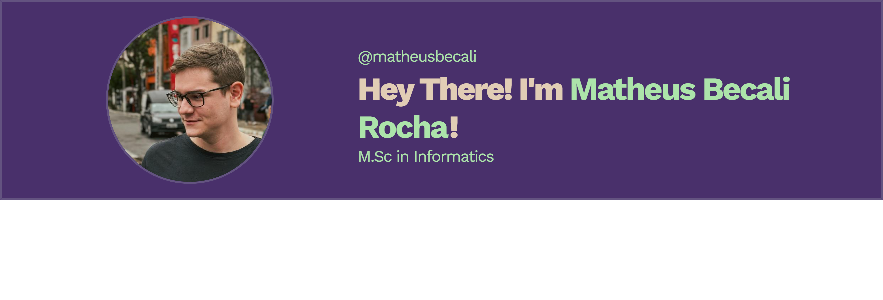

# 💫 About Me:

 
Hi, I’m <strong>Matheus Becali</strong>, B.Sc. in Industrial Mathematics and <strong>Master's<strong> in Computer Science with a focus on <strong>Deep Learning<strong>. My research aims to collect and study data from histopathological and clinical skin lesions.

I am a dedicated student, focused on studies and technology, always seeking to improve my knowledge through continuous learning.

“Risk comes from not knowing what you're doing.” — (Warren Buffet)

## 🌐 Socials:
  

# 💻 Tech Stack:

### Programming Languages: 

### ML/DL:

### IDEs/Editors:

# 📊 GitHub Stats:
<!---
#  
#  
--->
# 

<!---
## 🏆 GitHub Trophies

--->

### 🔝 Top Contributed Repo

---

<!-- Proudly created with GPRM ( https://gprm.itsvg.in ) -->
